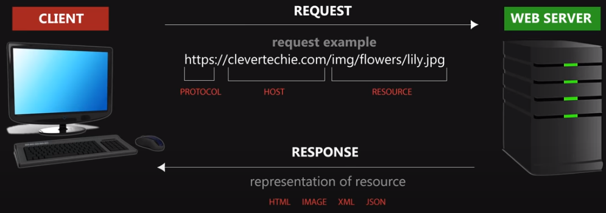
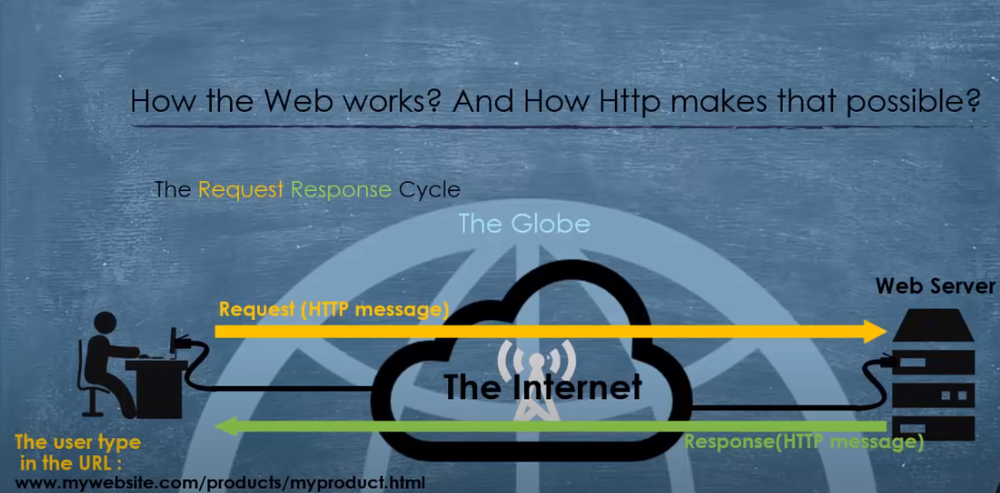
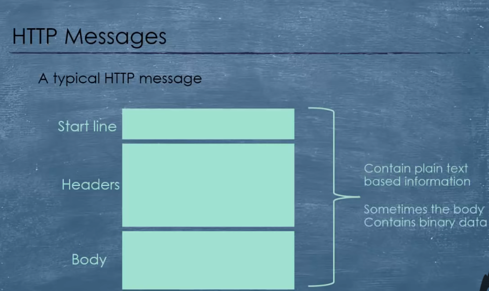
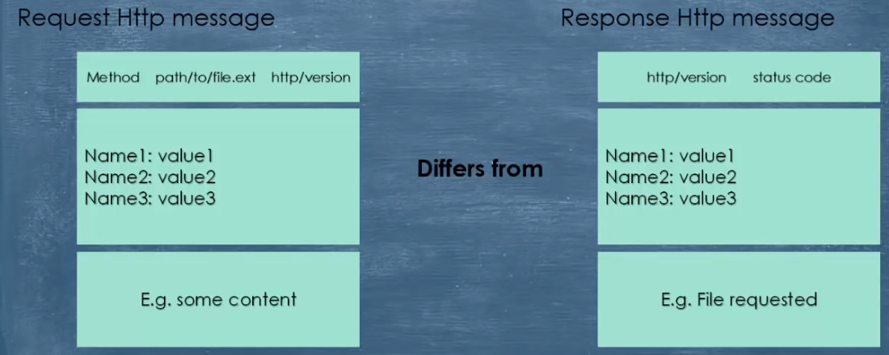
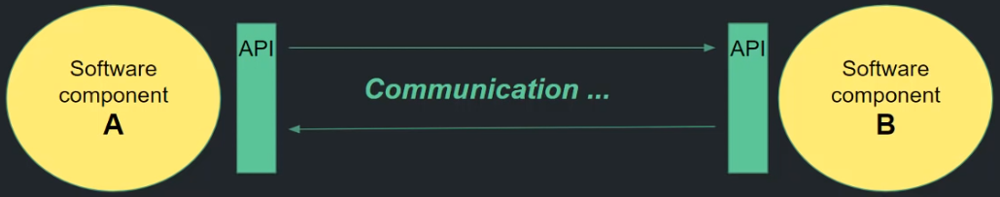
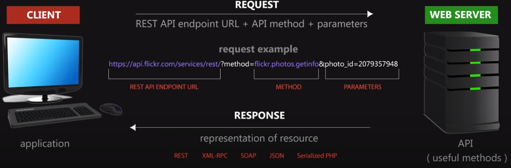

1. HTTP - Hypertext Transfer Protocol
2. API - Aplication Programming Interface
3. REST - REpresentational State Transfer
4. XML - eXtensible Markup Language
5. JSON - Javascript object notation
6. SOAP - Simple Object Access Protocol
7. Apps

## HTTP - Hypertext Transfer Protocol

> The HTTP is an application layer protocol, for sending and receiving messages over a network(client <-> server communication). 
The HTTp is the messenger of the web. 
It is a TCP/IP based protocol. 
It is used to deliver contents(images, videos, audios, documents, etc.)

> Every time you type URL in the browser, we use HTTP/ HTTPS

#### Important things about HHTP

1. HTTP is **connectionless**: after request, the client disconnect from server,
when response is ready, server re-establish the connection.
2. HTTP is **media independent**:HTTP can deliver any data, as long as two computers can read it. 
3. HTTP is **stateless**: client and server know about each other, just during the current request. If it closes and want to connect again, the connection is handled as first one.

#### HTTP request:
1. Start line - 
    - version(1.1), 
    - methods(get, post, put, delete), 
    - API program folder location(URI/search), 
    - parameters(?q=tuna),
    - format
2. Headers - 
    - host, 
    - token,
    - https://en.wikipedia.org/wiki/List_of_HTTP_header_fields 
3. Blank line - separate header from body
4. Body - username/pass
 
#### HTTP response: same parts
1. Start line - +status code(200 ok)
2. Headers - cookie
3. Blank line
4. Body - html

## API Aplication Programming Interface

> An API is the way to let software components to talk to each other. Give us access to additional functuinality. 

## REST - REpresentational State Transfer
> REST API is an API that follows the rules of REST specification. 
REST is a specification that dictates, how systems on the web should comunicate. 
REST is a way to implement and use HTTP. 

1. **Client-Server**. SystemA makes an HTTP request to a URL hosted by SystemB, which returns a response.
2. **Stateless**. The client request should contain all the information necessary to respond to a request. In other words, it should be possible to make two or more HTTP requests in any order and the same responses will be received.
3. **Cacheable**. A response should be defined as cacheable or not.
4. **Layered**. The requesting client need not know whether it’s communicating with the actual server, a proxy, or any other intermediary.
## Web Service
> Web services are set of rules and technologies that enable two or more components **on the web** to talk to each other 
API over internet - web service. 
Not every API is a web service

https://www.tutorialspoint.com/webservices/what_are_web_services.htm 

web = internet 
service = API 
Web service = API that uses the internet 

Web service use: 
 - XML or JSON to format data over the internet
 - REST, SOAP or XML/RPC to transfer that data

## XML - eXtensible Markup Language

HTTP header - content-type: application/xml 
HTTP body: XML 

## JSON - Javascript object notation
> Data representation format. 
Keys must be strings, and values must be a valid JSON data type (string, number, object, array, boolean or null).

HTTP header - content-type: application/json 
HTTP body: JSON 

## SOAP - Simple Object Access Protocol
>Rules to form HTTP req/res

Uses s WSDL(web services description language) 

1. Start line - POST WSDL HTTP version
2. Headers - content-type: text/xml
3. Blank line
4. Body - xml envelope formed using WSDL

## Apps

- Native
- Web
- Hybrid
